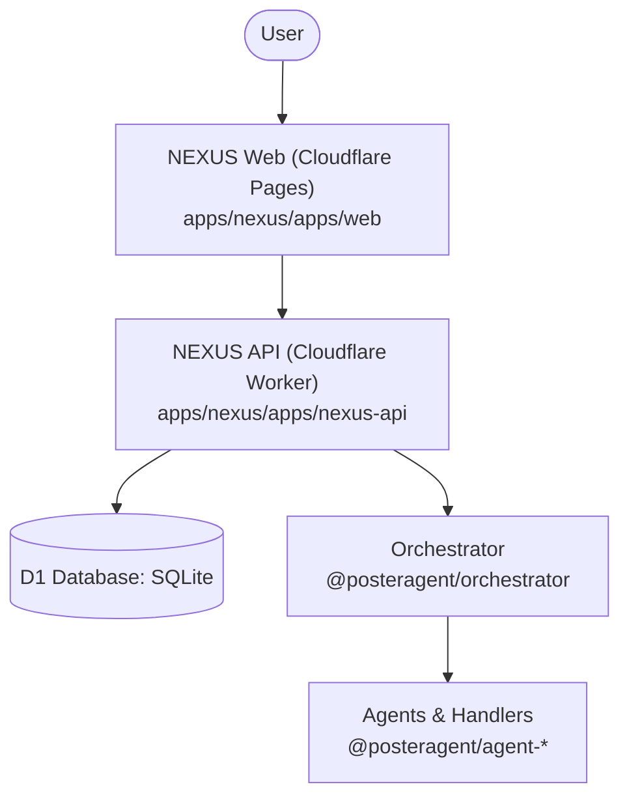

# PosterAgent System Architecture

This document describes the canonical architecture of the PosterAgent system.

## Overview

## Canonical Components

### 1. Canonical Dashboard
* **Path**: [apps/nexus/apps/web](file:///c:/a-g-e-n-t-p-o-s-t-e-r/apps/nexus/apps/web)
* **Technology**: Next.js App Router (deployed to Cloudflare Pages via `next-on-pages`).
* **Purpose**: Serves as the single user cockpit (Revenue metrics, publish queue, task command center).

### 2. Canonical API
* **Path**: [apps/nexus/apps/nexus-api](file:///c:/a-g-e-n-t-p-o-s-t-e-r/apps/nexus/apps/nexus-api)
* **Technology**: Hono running on Cloudflare Workers.
* **Purpose**: Serves all API requests from the frontend and gates endpoints using the access gate middleware.

### 3. Canonical Task System
* **Database**: Cloudflare D1 SQL Database.
* **Primary Table**: `agent_tasks` tracks task execution lifecycle (`inbox`, `planned`, `queued`, `running`, `needs_me`, `done`, `failed`, `archived`).

### 4. Canonical Orchestrator
* **Package**: [@posteragent/orchestrator](file:///c:/a-g-e-n-t-p-o-s-t-e-r/packages/orchestrator)
* **Bridge**: [orchestrator-bridge.ts](file:///c:/a-g-e-n-t-p-o-s-t-e-r/apps/nexus/apps/nexus-api/src/services/orchestrator-bridge.ts) maps and executes tasks by routing them to the correct agent package handlers.

---

## Workspace Package Mapping

| Package Path | Package Name | Purpose / Responsibility |
|---|---|---|
| `packages/types` | `@posteragent/types` | Canonical TS interfaces and types |
| `packages/logger` | `@posteragent/logger` | Shared logging infrastructure |
| `packages/identity` | `@posteragent/identity` | SOUL, persona, traits, and metadata |
| `packages/memory` | `@posteragent/memory` | Long/short term agent memory & journal storage |
| `packages/orchestrator`| `@posteragent/orchestrator`| Task orchestration and base agent classes |
| `packages/proactivity` | `@posteragent/proactivity` | Evaluates background/stale conditions and generates suggestions |
| `packages/agent-research`| `@posteragent/agent-research`| Market/niche search and report generation |
| `packages/agent-publisher`| `@posteragent/agent-publisher`| Handles final posting to social media platforms |
| `packages/agent-budget` | `@posteragent/agent-budget` | Cost estimation and daily budget enforcement |
| `packages/agent-revenue` | `@posteragent/agent-revenue` | Tracking of income streams and stripe imports |
| `packages/agent-autonome`| `@posteragent/agent-autonome`| Autonomous task execution and routing logic |
